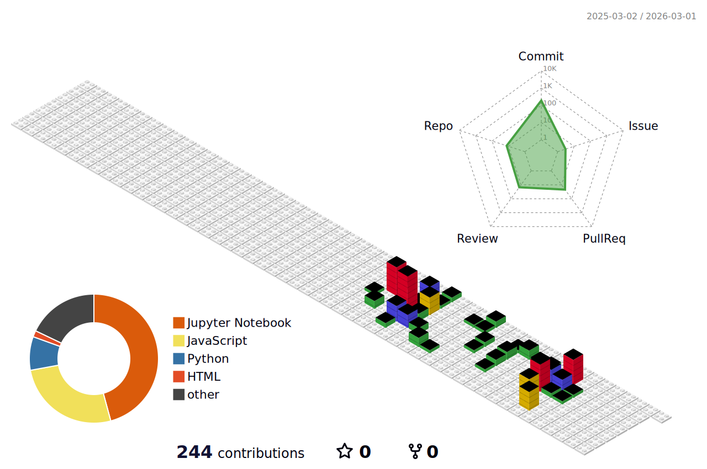

 

 
  🔥  

<h1>😀About me<h1>

🐌 I will become a developer who grows slowly but steadily. 
 
🔥 Since I started late, I will work twice as hard as others. 
 
✨If you don't lose your beginner's mind, anything is possible. 
 
 
 
 

 
I haven't started yet, but I'll fill it up soon.
 
 
 
 
Stacks 

 

 

 
 
 

<!--
**creeeeeeeeeeeeeping-source/creeeeeeeeeeeeeping-source** is a ✨ _special_ ✨ repository because its `README.md` (this file) appears on your GitHub profile.

Here are some ideas to get you started:

 🔭 I’m currently working on ...
- 🌱 I’m currently learning ...
- 👯 I’m looking to collaborate on ...
- 🤔 I’m looking for help with ...
- 💬 Ask me about ...
- 📫 How to reach me: ...
- 😄 Pronouns: ...
- ⚡ Fun fact: ...
-->

